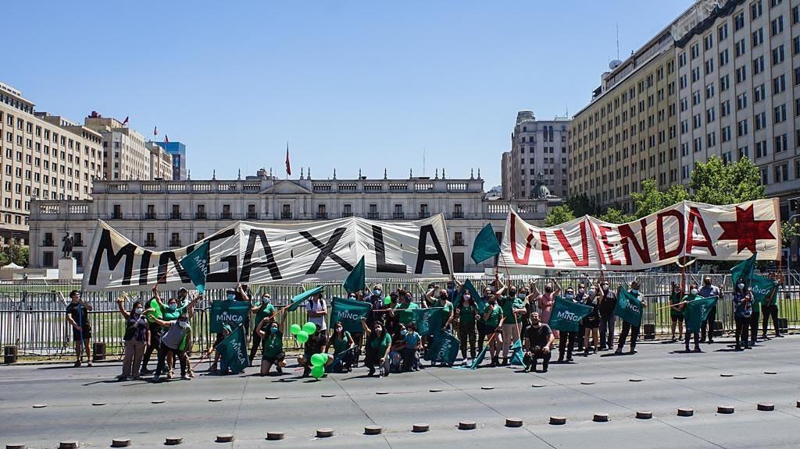
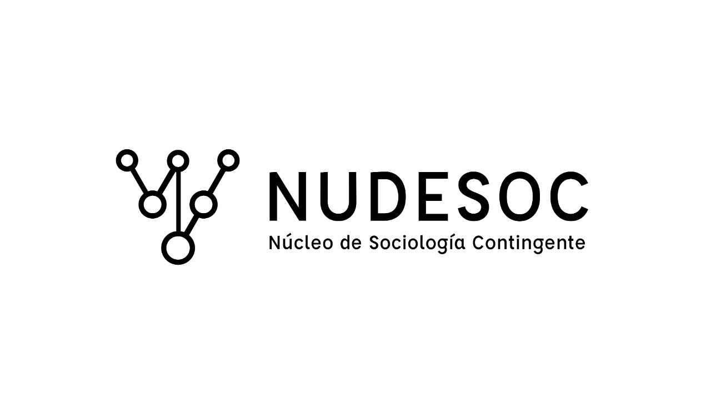

::::: {.justify}

<!--This is my personal clarity, please delete or replace with your own clarity-->


## La Minga (San Miguel)

::: {.grid}

::: {.g-col-12 .g-col-md-2}

:::

::: {.g-col-12 .g-col-md-10}

Since 2017, I have been involved in La Minga San Miguel, a community political organization in the district of San Miguel dedicated to strengthening local organization and neighborhood social ties. The initiative works with residents to identify collective needs and organize around them, including the development of a community cultural center and a housing committee composed of neighborhood families and workers from the Barros Luco Hospital union.

:::

:::

## Núcleo de Sociología Contingente (NUDESOC)

::: {.grid}

::: {.g-col-12 .g-col-md-2}

:::

::: {.g-col-12 .g-col-md-10}

In 2019, during the October social uprising in Chile, I took part in the Núcleo de Sociología Contingente (NUDESOC), a student-led initiative at the University of Chile aimed at producing empirical evidence on the unfolding political moment. Its work included a representative survey of protesters in Plaza Baquedano using methodologies adapted to protest settings, with the goal of documenting protesters’ demands and perceptions, challenging common misrepresentations, and contributing to public debate.

:::

:::
::::: 

