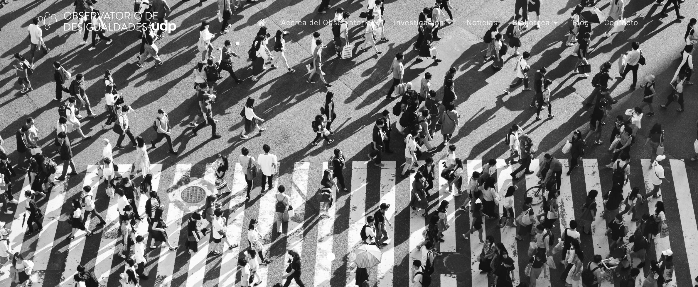

<!--This is my personal clarity, please delete or replace with your own clarity-->


<!--Include academic icons or buttons-->


## Market Justice and Deservingness of Social Welfare

::: {.grid}

::: {.g-col-12 .g-col-md-2}

:::

::: {.g-col-12 .g-col-md-10}

I am the principal research assistant for the Fondecyt project [“Market Justice and Deservingness of Social Welfare”](https://juancarloscastillo.github.io/jc-quarto/proyectos/posts/fondecyt-jusmer/) which studies attitudes toward the market allocation of social welfare benefits in Chile and their links to deservingness and merit criteria. The project combines comparative, longitudinal, survey, experimental, and political discourse analyses to examine how preferences for market justice in areas such as pensions, health, and education are shaped by institutional contexts and cultural beliefs.

:::

:::

## Wealth and Social Cohesion from a Relational Perspective (WESOREL)

::: {.grid}

::: {.g-col-12 .g-col-md-2}

:::

::: {.g-col-12 .g-col-md-10}

I work as research assistant for the Chilean partner team of the international project ["Wealth and Social Cohesion from a Relational Perspective (WESOREL),"](https://www.isi-munich.de/en/research-project/wealth-and-social-cohesion-from-a-relational-perspective) which studies how wealth inequality and the growing social distance between the affluent and the rest of society affect social cohesion. Drawing on longitudinal data from Chile, the project examines the relational dimensions of wealth and their implications for trust, social ties, and democratic coexistence.

:::

:::

## Inequality Observatory of the Diego Portales University

::: {.grid}

::: {.g-col-12 .g-col-md-2}

:::

::: {.g-col-12 .g-col-md-10}

I serve as research coordinator at the [Inequality Observatory of the Diego Portales University](https://observatoriodesigualdades.udp.cl/), where I contribute to the conceptual and statistical design of the ICSO-UDP survey, the analysis of survey data, and the development of innovative approaches to measuring inequality. My role also involves collaboration with Observatory researchers and the UDP Sociology program to engage students in research and to promote broader spaces for academic exchange 

:::

:::

## Social Cohesion Observatory

::: {.grid}

::: {.g-col-12 .g-col-md-2}

:::

::: {.g-col-12 .g-col-md-10}

I served as coordinator of the [Social Cohesion Observatory of the Center for the Study of Conflict and Social Cohesion](https://ocs-coes.com/), where I oversaw the Observatory’s research team and coordinated seminars and public engagement activities aimed at fostering academic and public exchange. I also contributed to research on social cohesion through literature review, data analysis using Chilean and Latin American sources, the development of interactive visualizations for the Observatory’s website, and the preparation of methodological documents, research notes, and blog posts.

:::

:::

## Socioeconomic and Gender Disparities: A Multi Country Study (SOGEDI)

::: {.grid}

::: {.g-col-12 .g-col-md-2}

:::

::: {.g-col-12 .g-col-md-10}

I worked as research assistant for the Chilean-Spanish project “Socioeconomic and Gender Disparities: A Multi-Country Study” (SOGEDI), contributing to data collection, data processing, and statistical analysis across different stages of the research. I also prepared analytical materials for academic publications, supported the drafting of papers and conference presentations, and coordinated research tasks and team activities.
:::

:::

## Meritocracy in schools: moral foundations of the education market and its implications for citizenship education in Chile

::: {.grid}

::: {.g-col-12 .g-col-md-2}

:::

::: {.g-col-12 .g-col-md-10}

I worked as research assistant for the project [“Meritocracy in Schools: Moral Foundations of the Education Market and Its Implications for Citizenship Education in Chile,”](https://juancarloscastillo.github.io/jc-quarto/proyectos/posts/fondecyt-edumer/) contributing to data collection, data processing, and statistical analysis across different stages of the research. I also prepared analytical materials for academic publications and conference presentations, supported the drafting of papers, and coordinated research tasks related to meritocracy, education, and citizenship attitudes in Chile.

:::

:::
